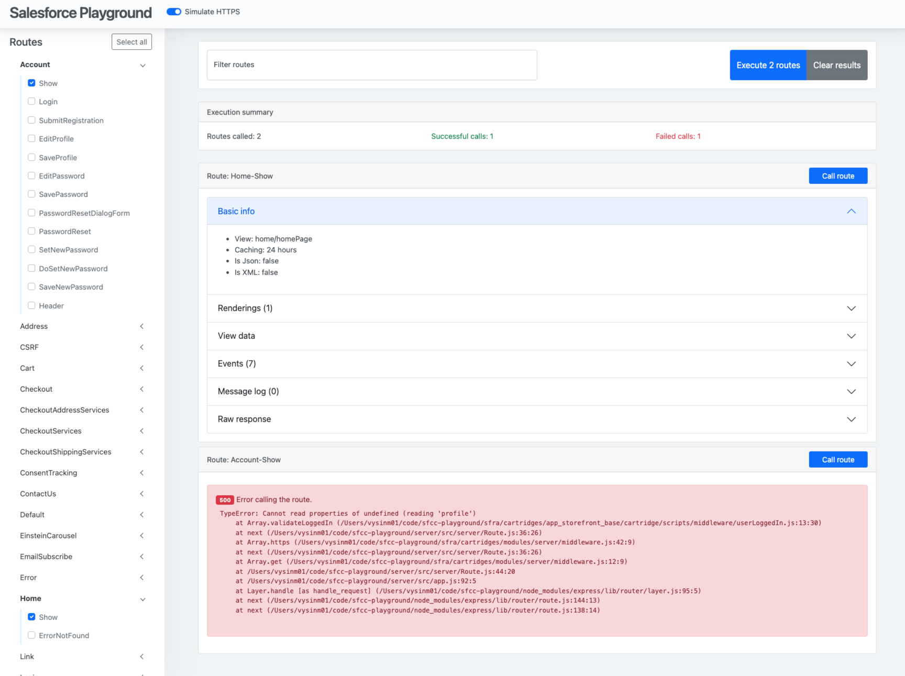

# Salesforce Commerce Cloud Playground



## Installation

`npm install --global sfcc-playground@beta`

or if you feel adventurous, use alpha

`npm install --global sfcc-playground@alpha`

The playground uses [`dw-api-mock`](https://github.com/SalesforceCommerceCloud/dw-api-mock.git). You need to be able to access the repository ([see the Trailhead module](https://trailhead.salesforce.com/content/learn/modules/b2c-developer-resources-and-tools/b2c-developer-access-repositories)).

## Configuration

The playground uses [cosmiconfig](https://github.com/davidtheclark/cosmiconfig) so you can use:

- a `sfcc-playground` property in package.json
- a `.sfcc-playgroundrc` file in JSON or YAML format
- a `.sfcc-playgroundrc.json`, `.sfcc-playgroundrc.yaml`, `.sfcc-playgroundrc.yml`, `.sfcc-playgroundrc.js`, or `.sfcc-playgroundrc.cjs` file
- a `sfcc-playground.config.js` or `sfcc-playground.config.cjs` CommonJS module exporting an object

### Configuration options

| Value | Description | Default value |
| --- | --- | --- |
| rootDir | Root directory of the project | `process.cwd()` |
| cartridgesDir | Path to cartridges directory | `${cwd}/cartridges` |
| cartridgePath | Cartridge path | app_storefront_base |
| modulesPath | Path to modules directory | `${cwd}/cartridges/modules` |
| apiPort | Port to use for API app | 8080 |

## Usage

Run the playground in your project folder (create a config file if needed).

```shell
sfcc-playground
```

Open browser on `http://localhost:8080` (or on the port you specified in the config).

## Roadmap

See [https://github.com/users/vysinsky/projects/1/views/1](https://github.com/users/vysinsky/projects/1/views/1)
